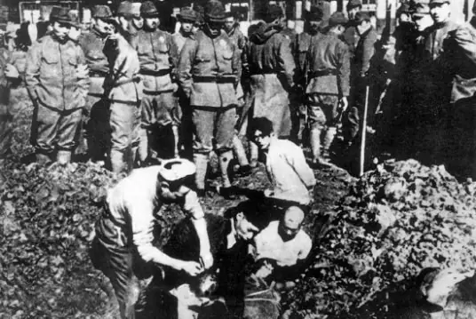

# $\color{red}{南京大虐殺を忘れないで}$
##### [简体中文](https://libps.github.io/Remember-Nanjing/zh/index) | [繁體中文](https://libps.github.io/Remember-Nanjing/zh-tc/index) | [ENGLISH](https://libps.github.io/Remember-Nanjing/en/index) | [日本語](https://libps.github.io/Remember-Nanjing/ja/index)
------------ -------------
1937年12月13日、日本軍が南京を占領した後、公然と国際条約を違反し、武器を放棄した中国人兵士と一般大衆を無差別に虐殺した。南京市の当時の三分の一の建築物が焼かれ破壊され、市内で起きた強姦、輪姦の暴行が二万件ほどあり、遭難者数が戦後南京審判戦犯軍事法廷の判決によると、30万以上に達している。古都南京は空前の災難に遭った。

 
南京大虐殺事件後、アメリカ『ニューヨーク？タイムズ』、『ライフ』雑誌、イギリス『タイムズ』、ソ連『プラウダ』、中国『中央日報』、『新華日報』などの新聞メディアは、事件について報道していた。南京に残った国内外の人士及び続々と南京に戻った欧米外交官たちが秘密に日本軍の暴行を文字とカメラで記録した。当時事件を目撃した南京の軍民たちが、大量の証言を残した。事件に参加した日本軍も事件についての記録を残したのである。

 

戦後、南京軍事法廷、極東国際軍事法廷（東京裁判）の日本戦犯に対する裁判で、共に 南京大虐殺についての事実確認が行われている。2015年10月に「南京大虐殺の記録」がユネスコ「世界記憶遺産」に登録されている。南京大虐殺惨事は、日本軍が侵華戦争時期に犯した数えられない暴行の中最も代表的な一例で、平和を擁護する人たちが銘記すべきな人類の大災難である。

